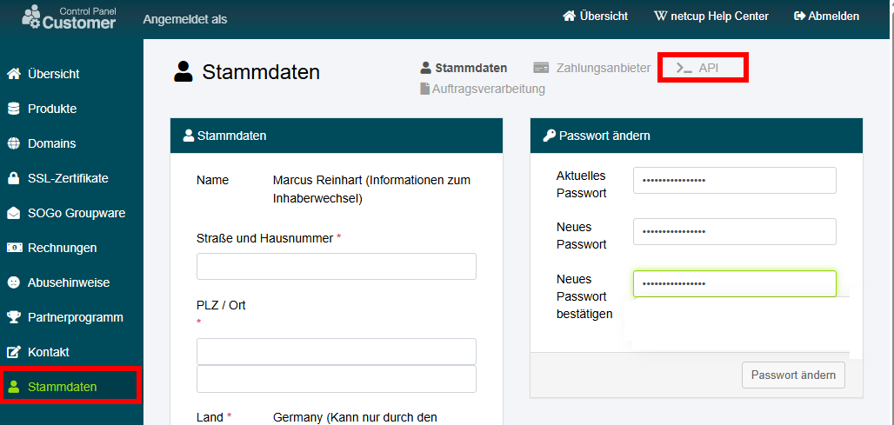

# NetCup DynDNS Client

[](https://dev.azure.com/Fachit360/NetCup%20DynDns%20Client/_build/latest?definitionId=2&branchName=main) 
[](https://sonarcloud.io/summary/new_code?id=FachIT360_NetCup-DynDns-Client) 
[](https://sonarcloud.io/summary/new_code?id=FachIT360_NetCup-DynDns-Client) 
[](https://sonarcloud.io/summary/new_code?id=FachIT360_NetCup-DynDns-Client) 
[](https://sonarcloud.io/summary/new_code?id=FachIT360_NetCup-DynDns-Client) 
[](https://sonarcloud.io/summary/new_code?id=FachIT360_NetCup-DynDns-Client)

A simple .NET 9 Service to update your NetCup DNS records over the public REST API from [NetCup GmbH](https://www.netcup.com/en/).

The focus of this client was to synchronize the IP address for individual DNS records. Currently, only 'A' records are reliably supported. 
Support for additional DNS record types will be added later.

## Getting Started

### Download

The DynDns Client is available as compressed precompiled binaries for linux-x64 and windows-x64 and can be downloaded from the [latest releases page](https://ftp.fachit360.de/netcup-dyndns/). 
After downloading you can extract the archive to a folder of your choice.

## Configuration

The easiest and fastest way to install the client is by editing the "appsettings.json" file in the main directory.

> <span style="color:cornflowerblue">🛈 Note!</span><br/>
> It is not recommended to store the API credentials in the appsetting.json on publicly accessible computers.
> 
> Instead, use environment variables. In the case of a docker, use the docker secret feature. In the case of Kubernetes, use the Kubernetes secrets.
> Bellow I'm providing two examples.

First, you need to get the API credentials from the NetCup Customer Control Panel at https://www.customercontrolpanel.de/.
In the following screenshot you can see the location where you can get the API credentials in the NetCup Customer Control Panel.

[](./assets/ccp-backend.png)

If you don't want to wait a long period of time for DNS propagation, you can set the TTL of your domain to 300 seconds.
To check if the propagation is finished, you can use the following Google search https://www.google.com/search?q=dns+propagation, and you will find a lot of tools to check this.

After that you can enter the credentials in the appsettings.json. The following JSON snippet shows the configuration.
You will recognize that the Login section is not present, and you have to copy them from the example. Remember to replace the placeholders with your credentials, and if you
want to install the client later on docker or kubernetes, you should use the environment variables and remove the Login section from the appsettings.json for security reasons.
Also, if the login section is present, the environment variables will be ignored.

Example for the appsettings.json:
````json
{
  "Logging": {
    "LogLevel": {
      "Default": "Debug",
      "System": "Warning",
      "Microsoft.Hosting.Lifetime": "Information"
    }
  },
  "NetCupApi": {
    "Login": {
      "ApiKey": "SqW235M4XLRPbv69XDreZ0qdWJOoC5CKmPnvn6VTogSKHQjMWX",
      "ApiPassword": "LO2t4md76hiZLYISIuPqezMYbZjnmtIIX6Nx+auzyjS34cfd1v",
      "CustomerNumber": 123456
    },
    "EndpointUrl": "https://ccp.netcup.net/run/webservice/servers/endpoint.php?JSON",
    "MyIp4ApiUrl": "https://api.ipify.org", // <-- This returns the raw public IP address of your Internet connection in verson 4.
    "MyIp6ApiUrl": "https://api6.ipify.org", // <-- This returns the raw public IP address of your Internet connection in verson 6.
    "RequestInterval": "00:05:00", // <-- The interval in which the client will check the IP address.
    "Domains": {
      "domain.com": [
        "@",
        "*",
        "subdomain1",
        "subdomain2"
      ]
    }
  }
}
````
### Configure Domains and DNS Records

The configuration of the domains and DNS records is done in the appsettings.json.
You define the domains and the DNS records as a collection of string that you want to update.
If you add the '@' and '*' entries, all wildcard subdomains will point to your public IP address after synchronization.

## Environment variables

You can also use environment variables to configure the client. The following environment variables are supported:

* NETCUP_LOGIN_APIKEY
* NETCUP_LOGIN_APIPASSWORD
* NETCUP_LOGIN_CUSTOMERNUMBER

### Setup environment variables for Linux

You can use the following bash command to set the environment variables:

```bash
export NETCUP_LOGIN_APIKEY=<YOUR_API_KEY>
export NETCUP_LOGIN_APIPASSWORD=<YOUR_API_PASSWORD>
export NETCUP_LOGIN_CUSTOMERNUMBER=<YOUR_NETCUP_CUSTOMER_NUMBER>
```

### Setup environment variables for Windows

You can use the following powershel command to set the environment variables:

```powershell
$env:NETCUP_LOGIN_APIKEY=<YOUR_API_KEY>
$env:NETCUP_LOGIN_APIPASSWORD=<YOUR_API_PASSWORD>
$env:NETCUP_LOGIN_CUSTOMERNUMBER=<YOUR_NETCUP_CUSTOMER_NUMBER>
```


## Run on a virtualization platform like Docker or Kubernetes

You can run the client on a virtualization platform like Docker or Kubernetes. I'm providing a Docker image of the latest release on Docker Hub.
You will find the image here: https://hub.docker.com/repository/docker/mreinhart2805/fit360-netcup-ddns-client/general.
The following sections will show you how to run the client on Docker or Kubernetes.

### Run as Docker Container

First, we need the NetCup API credentials as a Kubernetes secret definition.

```yaml
apiVersion: v1
metadata:
  namespace: network
  name: netcup-dns-api-secrets
type: Opaque
data:
  api-key: <YOUR_API_KEY>
  api-password: <YOUR_API_PASSWORD>
  customer-number: <YOUR_NETCUP_CUSTOMER_NUMBER>
```

Replace the placeholders with your credentials and save the file as "netcup-dns-api-secrets.yaml". Now we can apply the secret definition to the Kubernetes cluster.
We can do this by running the following command:

`kubectl apply -f netcup-dns-api-secrets.yaml`

### Run in Kubernetes

# Run Tests

* Der Test ist abhängig vom NetCup API Service

`dotnet test -e NETCUP_LOGIN_APIKEY="SqW235M4XLRPbv69XDreZ0qdWJOoC5CKmPnvn6VTogSKHQjMWX" -e NETCUP_LOGIN_APIPASSWORD="LO2t4md76hiZLYISIuPqezMYbZjnmtIIX6Nx+auzyjS34cfd1v" -e NETCUP_LOGIN_CUSTOMERNUMBER="123456" --collect "XPlat Code Coverage;Format=opencover"`

# Known Issues

IPv6

#### Support my work

[](https://ko-fi.com/J3J01JYMKA)